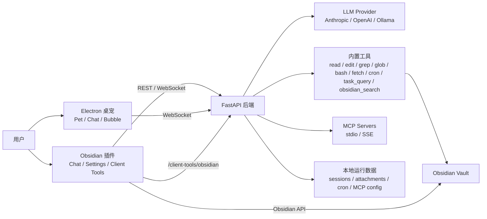

# LifeAssistantAgent 技术路线文档

Last updated: 2026-04-26

本文按当前代码实现整理，目标是让维护者快速理解系统采用什么技术、整体怎么分层、关键能力如何串起来，以及后续迭代应沿着哪些边界推进。

会话/对话分层、活跃分支缓存与上下文拼接的讨论稿见 [会话设计.md](./会话设计.md)。

## 1. 项目定位

LifeAssistantAgent 是一个围绕本地 Obsidian Vault 构建的个人 AI 助手系统。它的核心目标是：在本地优先的前提下，把 Obsidian 知识库、LLM、MCP 外部工具、会话记忆、技能/人格配置和桌面陪伴入口连接成一个可持续扩展的助手平台。

当前系统由三块主要客户端/服务组成：

- Python FastAPI 后端：负责 LLM 调用、工具执行、MCP 连接、会话/附件持久化、运行时配置和管理 API。
- Obsidian TypeScript 插件：负责 Vault 内聊天 UI、设置页、后端生命周期管理、MCP 配置编辑，以及 Obsidian 原生搜索桥接。
- Electron 桌宠客户端：作为轻量桌面入口，复用后端会话和 WebSocket 流式对话能力。

## 2. 总体架构



主链路是：客户端发起对话，后端组装系统提示词、会话上下文、人格、技能和工具目录，调用 LLM；LLM 如需工具，后端执行内置工具、MCP 工具或 Obsidian 客户端工具，再把结果送回模型继续推理，最终将流式回复返回客户端。

## 3. 技术选型

| 层级 | 当前技术 | 作用 |
|---|---|---|
| 后端服务 | Python 3.11+、FastAPI、uvicorn | HTTP、WebSocket、运行时管理 |
| 后端包管理 | uv | 依赖安装、测试运行、开发环境 |
| 数据模型 | Pydantic / pydantic-settings | API 入参、工具 schema、环境配置 |
| LLM 调用 | httpx | Anthropic Messages API、OpenAI-compatible、Ollama |
| 工具协议 | 自定义 Tool 抽象 + MCP Python SDK | 内置工具和外部 MCP 工具统一注册 |
| Obsidian 插件 | TypeScript、Obsidian API、esbuild | 聊天侧边栏、设置页、Vault 搜索、后端管理 |
| 桌宠客户端 | Electron、TypeScript、esbuild、Vitest | 桌面入口、托盘、气泡、独立聊天窗 |
| 富文本展示 | marked、DOMPurify | 桌宠聊天 Markdown 渲染与净化 |
| 定时任务 | croniter | 后端 cron 工具和后台触发 |
| 网页抓取 | httpx、BeautifulSoup、markdownify | fetch 工具 |
| 测试 | pytest、pytest-asyncio、Vitest、Node assert | 后端、插件配置、桌宠逻辑验证 |

## 4. 后端设计

后端入口是 `server/main.py`，启动时完成以下装配：

- 创建默认工具注册表。
- 加载 MCP 配置并注册 MCP 工具。
- 加载 prompt、skill、persona 运行时配置。
- 初始化会话存储和附件存储。
- 启动 cron 后台任务和自动保存后台任务。
- 挂载 REST、WebSocket、session、attachment、admin、client-tools 路由。

后端核心模块边界：

- `server/api/`：对外 API 层，包括 `/chat`、`/sessions/{session_id}/conversations/{conversation_id}/ws`、`/sessions`、conversation-scoped messages/context stats、`/attachments`、`/admin/*`、`/client-tools/obsidian`。
- `server/llm/`：LLM 适配、系统提示词组装、上下文计量、工具执行循环。
- `server/tools/`：内置工具系统。所有工具继承统一 `Tool` 抽象，使用 Pydantic schema 描述输入。
- `server/mcp_client/` 与 `server/mcp_runtime.py`：MCP 连接、工具桥接、热重载和状态汇报。
- `server/memory/`：文件持久化会话存储，按 session JSON 保留多轮上下文和待注入通知。
- `server/personas/`、`server/skills/`：从 Markdown + YAML frontmatter 加载人格和技能配置。
- `server/runtime_config.py`：把可热加载的 prompt-adjacent 配置注入 API 层。

后端把所有工具统一转成 LLM 可消费的 schema，并通过 `ToolRegistry` 区分来源：`builtin`、`mcp`、以及未来其他来源。这样内置工具、MCP 工具和客户端工具可以共享同一套模型调用路径。

## 5. LLM 与工具执行

LLM 客户端统一暴露非流式和流式接口：

- Anthropic 走 Messages API。
- OpenAI-compatible 和 Ollama 走 `/chat/completions` 风格接口。
- 内部把 OpenAI tool call 转换成 Anthropic-like 内容块，降低上层分支复杂度。

工具执行流程：

1. 模型返回 `tool_use` / `tool_call`。
2. 后端从 `ToolRegistry` 查找工具。
3. 使用工具的 Pydantic schema 校验输入。
4. 执行工具权限检查。
5. 调用工具并生成 `ToolResult`。
6. 将结果分别格式化给 LLM 和 UI。
7. 将工具结果写回会话上下文，继续下一轮模型推理。

当前内置工具覆盖：

- Vault/文件类：`obsidian_search`、`read`、`edit`、`grep`、`glob`、`task_query`。
- 系统/网络类：`bash`、`fetch`。
- 计划任务类：`cron_create`、`cron_list`、`cron_delete`。

`obsidian_search` 是首选的 Obsidian 知识检索工具，它不直接读文件系统，而是通过运行中的 Obsidian 插件执行 `.md` 和 `.canvas` 搜索，保留 Obsidian 的 metadata、tag、section、task、property 语义。

## 6. MCP 设计

MCP 配置使用 JSON 文件管理，默认路径为 `server/data/mcp_servers.json`，示例为 `server/data/mcp_servers.example.json`。后端支持：

- `stdio` MCP server：通过 command + args 启动。
- `sse` MCP server：通过 URL 连接。
- `${ENV_VAR}` 插值：优先系统环境变量，其次 `.env`。
- 热重载：`POST /admin/reload` 重新读取 `.env`、技能/人格配置和 MCP 配置。
- 事务式更新：新 MCP 连接和工具注册成功后才替换旧注册表，失败时保留原运行状态。

Obsidian 设置页提供 MCP 配置读写、校验、从模板创建、保存并重载、运行状态查看，降低手工维护 JSON 的成本。

## 7. Obsidian 插件设计

插件入口是 `obsidian-plugin/src/main.ts`。加载时会：

- 读取并迁移插件设置。
- 创建或检查插件运行目录。
- 启动后端运行时管理器。
- 建立 Obsidian 客户端工具桥接 WebSocket。
- 注册聊天侧边栏和设置页。

主要能力分布：

- `src/chat/`：聊天 UI、会话列表、转录渲染、输入框、技能 slash suggestion、`@file` / `@folder` mention、图片粘贴和流式回复处理。
- `src/api/client.ts`：REST/WebSocket 客户端，处理 session、persona、skill、capability、MCP admin API。
- `src/runtime/`：后端运行目录、`.env`、prompt/persona 模板、开发/生产运行时启动。
- `src/config/`：LLM profile、Vault 路径同步、MCP 配置本地读写与热重载。
- `src/clientTools/` 与 `src/search/`：将 Obsidian 原生搜索作为后端可调用工具暴露。

插件是 Vault 内最重要的“本地集成层”：它既负责用户体验，也负责通过 Obsidian API 读取元数据和执行 Obsidian-native 搜索。

## 8. 桌宠客户端设计

桌宠位于 `desktop-pet/`，使用 Electron 提供常驻桌面入口。它不直接实现 AI 能力，而是复用后端 WebSocket 对话协议。

核心模块：

- `src/main/index.ts`：Electron 主进程、窗口、托盘、拖动、设置窗口、气泡窗口和 IPC。
- `src/main/backendClient.ts`：后端 WebSocket 客户端，维护连接、重连、流式事件和系统通知。
- `src/main/conversationManager.ts`：会话快照、未读计数、自动继续、工具进度和气泡状态。
- `src/renderer/`：pet、chat、bubble、settings 四类界面。
- `src/shared/`：跨主进程和渲染进程共享类型、默认配置、历史恢复逻辑。

桌宠的定位是低打扰入口：显示在线状态、气泡提醒、未读数量，并在需要时打开完整聊天窗口。

## 9. 配置与运行时

配置分三层：

- 仓库级 `.env` / 插件运行目录 `.env`：LLM provider、模型、密钥、Vault 路径、端口、admin token、prompt/persona 目录。
- MCP JSON：外部 MCP server 定义和环境变量引用。
- Markdown 配置：`prompts/`、`personas/`、`skills/` 作为可读、可版本化的行为配置。

Obsidian 插件运行时会在插件目录下维护自己的配置、数据、日志和后端 runtime 状态；开发模式可通过 `.dev-runtime.json` 指向仓库内后端，生产模式可安装独立后端可执行文件。

## 10. 数据与状态

当前持久化以本地文件为主：

- 会话：`server/data/sessions/*.json` 或插件运行目录 data 下的 sessions。
- 附件：`server/data/attachments/` 或插件运行目录 data 下的 attachments。
- MCP 配置：`mcp_servers.json`。
- cron 任务：Vault 下 `.LifeAssistantAgent/data/cron_jobs.json`。
- prompt/persona/skill：Markdown 文件。

这条路线的优势是本地可审计、易备份、避免过早引入数据库。只有当会话、附件、索引或审计需求明显增长时，再考虑 SQLite 或向量库等更重的状态层。

## 11. 安全边界

当前安全边界主要依赖以下机制：

- 环境密钥通过 `.env` 和 MCP `${ENV_VAR}` 引用管理，不写入 MCP JSON 示例。
- `read` 工具阻止 `.env`、credentials、secret 等敏感文件名。
- 文件工具做 Vault 路径逃逸检查。
- admin API 默认关闭，启用时要求 `X-Life-Assistant-Admin-Token`。
- Obsidian 搜索桥接只搜索 `.md` 和 `.canvas`，并排除 `.obsidian`、`.LifeAssistantAgent`、`.git`、`node_modules`、`.venv` 等目录。
- 插件运行时启动后端时显式传入 `ENV_FILE`、`MCP_CONFIG_FILE`、`DATA_DIR`、`LOG_DIR`、`VAULT_PATH` 等隔离路径。

后续如果继续扩大写入能力，应优先把写操作收敛到明确的工具白名单和用户确认流，而不是让模型自由写 Vault。

## 12. 开发与验证

后端：

```bash
cd server
uv sync --dev
uv run python main.py
uv run pytest
uv run ruff check .
```

Obsidian 插件：

```bash
cd obsidian-plugin
npm run build
npm run test:config
npm run dev
```

桌宠：

```bash
cd desktop-pet
npm run typecheck
npm run test
npm run build
npm run start
```

验证策略：

- 后端 API、工具、MCP、session 行为优先使用 pytest。
- 插件配置、MCP、本地搜索 DSL 使用 `npm run test:config`。
- 桌宠主进程和共享逻辑使用 Vitest。
- 跨端改动同时跑后端和对应客户端检查。

## 13. 后续技术路线

短期重点：

- 稳定 Obsidian 搜索桥接和后端 fallback 搜索策略。
- 补齐工具权限模型，区分只读、用户确认写入、后台自动任务写入。
- 继续增强 LLM profile、prompt、persona、skill 的热重载体验。
- 保持后端 WebSocket 协议稳定，让 Obsidian 插件和桌宠都能复用。

中期重点：

- 增强会话压缩和上下文预算管理，减少长会话 token 压力。
- 建立更明确的任务/提醒/后台通知模型，统一 cron 与自动继续机制。
- 将插件端 Obsidian-native 能力扩展为更多 client-hosted tools。
- 对 MCP 工具增加更细的来源、权限和错误观测。

长期重点：

- 按需引入结构化本地存储，用于会话索引、审计、任务状态和检索缓存。
- 构建更完整的个人记忆层，把短期会话、长期偏好、项目状态和 Vault 事实区分管理。
- 完善生产运行时安装、升级、签名校验和跨平台发布流程。
- 形成统一的端到端测试链路，覆盖 Obsidian 插件、后端、桌宠和 MCP 的核心交互。
